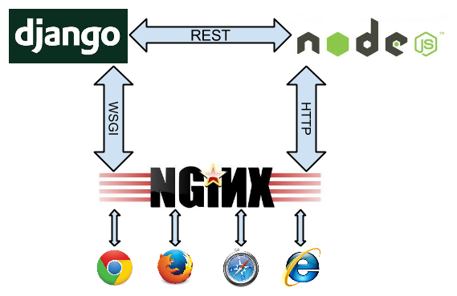

.. introduction

============
Introduction
============

Application servers such as Django and Ruby-on-Rails have been developed without intention to create
long living connections. Therefore these frameworks are not a good fit for web applications, which
shall react on asynchronous events initiated by the server. One feasible solution for clients
wishing to be notified for events is to continuously poll the server using an XMLHttpRequest (Ajax).
This however produces a lot of traffic, and depending on the granularity of the polling interval,
it is not a viable solution for real time events such as chat applications or browser based
multiplayer games.

Web application written in Python usually use WSGI as the communication layer between the
webserver and themselves. WSGI is a stateless protocol which defines how to handle requests and
making responses in a simple way abstracted from the HTTP protocol, but by design it does not
support non-blocking requests.

The WSGI protocol can not support websockets
============================================

In Django, the web server accepts an incoming request, sets up a WSGI dictionary which then is
passed to the application server. There the HTTP headers and the payload is created and immediately
afterwards the request is finished and flushed to the client. This processing typically requires
a few dozen milliseconds. The throughput, such a server can handle, is the average response
time multiplied by the number of concurrent workers. Each worker requires its own thread/process
and a good rule of thumb is to configure not more than twice as many workers as the number of cores
available on that host. Otherwise you will see a decrease in overall performance, caused by too
many context switches, for which the scheduler of the operating system is responsible.

Due to this workflow, it is almost impossible to add support for long term connections, such as
websockets, on top of the WSGI protocol specification. Therefore most websocket implementations go
for another approach. The websocket connection is controlled by a service running side by side
with the default application server. Here, a webserver with support for long term connections,
dispatches the requests from the clients.

A webserver able to dispatch websocket requests is the NGiNX_ server. Normal requests are sent to
Django using the WSGI protocol, whereas the long living websocket connections are passed over to
a special service responsible only for that.

A typical implementation proposal is to use socket.io_ running inside a NodeJS_ loop.

|websocket-nodejs|

Here, **Django** communicates with **Node.JS** using a RESTful API. This however is hard to maintain
because it pulls in two completely different technologies. In alternative proposals, other Python
based asynchronous event frameworks such as Tornado_ or Twisted_ are used. But they all look like
makeshift solutions, since one has to run a second framework side by side with **Django**. This
makes the project dependent on another infrastructure and thus harder to maintain. Moreover, having
to run two concurrent frameworks can be quite embarrassing during application development,
specially while debugging code.

uWSGI
=====

While searching for a simpler solution, I found out that `uWSGI offers websockets`_ right out of
the box. With Redis_ as a message queue, and a few lines of Python code, one can bidirectionally
communicate with any WSGI based framework, for instance **Django**. Of course, here it also is
prohibitive to create a new thread for each open websocket connection. Therefore that part of the
code runs in one single thread/process for all open connections in a cooperative concurrency mode
using the excellent gevent_ and greenlet_ libraries.

This approach has some advantages:

* It is simpler to implement.
* The asynchronous I/O loop handling websockets can run
	* inside Django with ``./manage.py runserver``, giving full debugging control.
	* as a stand alone HTTP server, using uWSGI.
	* using NGiNX or Apache (>= 2.4) as proxy in two decoupled loops, one for WSGI and one for
	  websocket HTTP in front of two separate uWSGI workers.
* The whole Django API is available in this loop, provided that no blocking calls are made.
  Therefore the websocket code can access the Django configuration, the user and the session cache,
  etc.

Using Redis as a message queue
==============================

One might argue that all this is not as simple, since an additional service – the Redis data server
– must run side by side with Django. Websockets are bidirectional but their normal use case is to
trigger server initiated events on the client. Although the other direction is possible, it can
be handled much easier using Ajax – adding an additional TCP/IP handshake.

Here, the only “stay in touch with the client” is the file descriptor attached to the websocket.
And since we speak about thousands of open connections, the footprint in terms of memory and CPU
resources must be brought down to a minimum. In this implementation, only one open file handle
is required for each open websocket connection.

Productive webservers require some kind of session store anyway. This can be a memcached_ or a
Redis data server. Therefore, such a service must run anyway and if we can choose between one
of them, we shall use one with integrated message queuing support. When using Redis for caching and
as a session store, we practically get the message queue for free.

Scalability
-----------

One of the nice features of Redis is its infinite scalability. If one Redis server can't handle its
workload, interconnect it with another one and all events and messages are mirrored across this
network. Since **django-websocket-redis** can be deployed multiple times and as self-contained
Django applications, this configuration can scale infinitely, just interconnect the Redis servers
to each other.

On the main entry point of your site, add a loadbalancer capable of proxying the websocket protocol.
This can be any OSI level 4 loadbalancer such as the `Linux Virtual Server`_ project, or if you
prefer OSI level 7, the excellent HAProxy_.

.. _NodeJS: http://nodejs.org/
.. _socket.io: http://socket.io/
.. _Tornado: http://www.tornadoweb.org/
.. _Twisted: http://twistedmatrix.com/
.. _NGiNX: http://nginx.com/
.. _uWSGI offers websockets: http://uwsgi-docs.readthedocs.org/en/latest/WebSockets.html
.. _Redis: http://redis.io/
.. _memcached: http://memcached.org/
.. _gevent: http://www.gevent.org/
.. _greenlet: http://greenlet.readthedocs.org/

.. _Linux Virtual Server: http://www.linuxvirtualserver.org/
.. _HAProxy: http://blog.haproxy.com/2012/11/07/websockets-load-balancing-with-haproxy/
