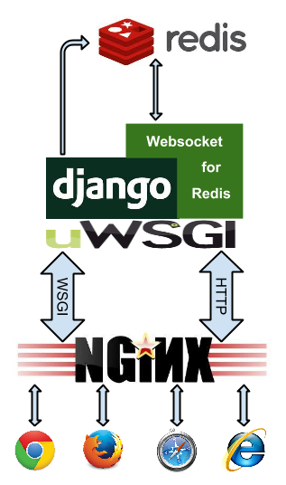

.. running

===========================
Running WebSocket for Redis
===========================

**WebSocket for Redis** is a library which runs side by side with Django. It has its own separate
main loop, which does nothing else than keeping the WebSocket alive and dispatching requests
from **Redis** to the configured WebSockets and vice versa.

Django with WebSockets for Redis in development mode
====================================================

With **WebSockets for Redis**, a Django application has immediate access to code written for
WebSockets. Make sure, that Redis is up and accepts connections.

.. code-block:: bash

	$ redis-cli ping
	PONG

Then start the Django development server.

.. code-block:: bash

	./manage.py runserver

As usual, this command shall only be used for development.

The ``runserver`` command is a monkey patched version of the original Django main loop and works
similar to it. If an incoming request is of type WSGI, everything works as usual. However, if the
patched handler detects an incoming request wishing to open a WebSocket, then the Django main
loop is hijacked by **ws4redis**. This separate loop then waits until ``select`` notifies that some
data is available for further processing, or by the WebSocket itself, or by the Redis message queue.
This hijacked main loop finishes when the WebSocket is closed or when an error occurs.

.. note:: In development, one thread is created for each open WebSocket.

Opened WebSocket connections exchange so called Ping/Pong messages. They keep the connections open,
even if there is no payload to be sent. In development mode, the “WebSocket” main loop does not send
these stay alive packages, because normally there is no proxy or firewall between the server and the
client which could drop the connection. This could be easily implemented, though.

Django with WebSockets for Redis as a stand alone uWSGI server
==============================================================

In this configuration the **uWSGI** server owns the main loop. To distinguish WebSockets from
normals requests, modify the Python starter module ``wsgi.py`` to

.. code-block:: python

	import os
	os.environ.setdefault('DJANGO_SETTINGS_MODULE', 'myapp.settings')
	from django.conf import settings
	from django.core.wsgi import get_wsgi_application
	from ws4redis.uwsgi_runserver import uWSGIWebsocketServer
	
	_django_app = get_wsgi_application()
	_websocket_app = uWSGIWebsocketServer()
	
	def application(environ, start_response):
	    if environ.get('PATH_INFO').startswith(settings.WEBSOCKET_URL):
	        return _websocket_app(environ, start_response)
	    return _django_app(environ, start_response)

Run uWSGI as stand alone server with

.. code-block:: bash

	uwsgi --virtualenv /path/to/virtualenv --http :80 --gevent 100 --http-websockets --module wsgi

This will answer, both Django and WebSocket requests on port 80 using HTTP. Here the modified
``application`` dispatches incoming requests depending on the URL on either a Django handler or
into the WebSocket's main loop.

This configuration works for testing uWSGI and low traffic sites. Since uWSGI then runs in one
thread/process, blocking calls such as accessing the database, would also block all other HTTP
requests. Adding ``--gevent-monkey-patch`` to the command line may help here, but Postgres for
instance requires to monkey patch its blocking calls with **gevent** using the psycogreen_ library.
Moreover, only one CPU core is then used, and static files must be handled by another webserver.

Serving static files
--------------------

In this configuration, you are not able to serve static files, because Django does not run in debug
mode and uWSGI does not know how to server your deployed static files. Therefore in ``urls.py`` add
``staticfiles_urlpatterns`` to your urlpatterns:

.. code-block:: python

	from django.conf.urls import url, patterns, include
	from django.contrib.staticfiles.urls import staticfiles_urlpatterns

	urlpatterns = patterns('',
	    ....
	) + staticfiles_urlpatterns()

.. note:: Remember to remove ``staticfiles_urlpatterns`` when upgrading to a more scalable
	configuration as explained in the next section.

Django with WebSockets for Redis behind NGiNX using uWSGI
=========================================================

This is the most scalable solution. Here two instances of a uWSGI server are spawned, one to handle
normal HTTP requests for Django and one to handle WebSocket requests.

|websocket4redis|

Assure that you use NGiNX version 1.3.13 or later, since earlier versions have no support for
WebSocket proxying. The web server undertakes the task of dispatching normal requests to one uWSGI
instance and WebSocket requests to another one. The responsible configuration section for
NGiNX shall look like:

.. code-block:: nginx

	location / {
	    include /etc/nginx/uwsgi_params;
	    uwsgi_pass unix:/path/to/django.socket;
	}
	
	location /ws/ {
	    proxy_http_version 1.1;
	    proxy_set_header Upgrade $http_upgrade;
	    proxy_set_header Connection "upgrade";
	    proxy_pass http://unix:/path/to/web.socket;
	}

For details refer to NGiNX's configuration on `WebSocket proxying`_.

.. _WebSocket proxying: http://nginx.org/en/docs/http/websocket.html

Since both uWSGI handlers create their own main loop, they also require their own application and
different UNIX sockets. Create two adopter files, one for the Django loop, say ``wsgi_django.py``

.. code-block:: python

	import os
	os.environ.update(DJANGO_SETTINGS_MODULE='my_app.settings')
	from django.core.wsgi import get_wsgi_application
	application = get_wsgi_application()

and one for the WebSocket loop, say ``wsgi_websocket.py``

.. code-block:: python

	import os
	import gevent.socket
	import redis.connection
	redis.connection.socket = gevent.socket
	os.environ.update(DJANGO_SETTINGS_MODULE='my_app.settings')
	from ws4redis.uwsgi_runserver import uWSGIWebsocketServer
	application = uWSGIWebsocketServer()

Start those two applications as separate uWSGI instances

.. code-block:: bash

	uwsgi --virtualenv /path/to/virtualenv --socket /path/to/django.socket --buffer-size=32768 --workers=5 --master --module wsgi_django
	uwsgi --virtualenv /path/to/virtualenv --http-socket /path/to/web.socket --gevent 1000 --http-websockets --workers=2 --master --module wsgi_websocket

The NGiNX web server is now configured as a scalable application server which can handle a thousand
WebSockets connections concurrently.

If you feel uncomfortable with separating WebSocket from normal requests on NGiNX, consider
that you already separate static and media requests on the web server. Hence, WebSockets are just
another extra routing path.

.. _psycogreen: https://bitbucket.org/dvarrazzo/psycogreen/

Django with WebSockets for Redis behind Apache-2.4 using uWSGI
==============================================================

Mike Martinka <mike.martinka@ntrepidcorp.com> reported this configuration, which allows to run
**ws4redis** with Apache-2.4 and later.

Configuratin for uWSGI:

.. code-block:: ini

	[uwsgi]
	env=DJANGO_SETTINGS_MODULE=<app>.settings
	module=<module>:application
	master=True
	http-socket=127.0.0.1:9090
	http-websockets=true
	gevent=1000
	workers=2
	plugin=python

Configuration section for Apache:

.. code-block:: guess

	<VirtualHost IPADDR:80>
	    ProxyPass    /ws/    ws://127.0.0.1:9090/
	</VirtualHost>

Django with WebSockets for Redis as a stand alone uWSGI server in emperor mode
==============================================================================

In this configuration the **uWSGI** server owns both main loops. To distinguish WebSockets from
normal requests, use uWSGI's `internal routing`_ capabilities.

.. note:: The internal routing capabilities of uWSGI is dependent on the Perl Compatible Regular Expressions
	(PCRE) library. Make sure that your uWSGI was built with PCRE support if you plan to run in emperor mode.
	Please refer to the :ref:`PCRE Support` section below for more information.

First create the two applications, ``wsgi_django.py`` and ``wsgi_websocket.py`` using the same code
as in the above example. These are the two entry points for uWSGI. Then create these three
ini-files, one for the emperor, say ``uwsgi.ini``:

.. code-block:: ini

	[uwsgi]
	emperor = vassals
	http-socket = :9090
	die-on-term = true
	offload-threads = 1
	route = ^/ws uwsgi:/var/tmp/web.socket,0,0
	route = ^/ uwsgi:/var/tmp/django.socket,0,0

Create a separate directory named ``vassals`` and add a configuration file for the Websocket
loop, say ``vassals/wsserver.ini``:

.. code-block:: ini

	; run the Websocket loop
	[uwsgi]
	umask = 002
	virtualenv = /path/to/your/virtualenv
	chdir = ..
	master = true
	no-orphans = true
	die-on-term = true
	memory-report = true
	env = DJANGO_SETTINGS_MODULE=my_app.settings
	socket = /var/tmp/web.socket
	module = wsgi_websocket:application
	threads = 1
	processes = 1
	http-websockets = true
	gevent = 1000

To the directory named ``vassals``, add a configuration file for the Django loop, say
``vassals/runserver.ini``:

.. code-block:: ini

	; run the Django loop
	[uwsgi]
	umask = 002
	virtualenv = /path/to/your/virtualenv
	chdir = ..
	master = true
	no-orphans = true
	die-on-term = true
	memory-report = true
	env = DJANGO_SETTINGS_MODULE=my_app.settings
	socket = /var/tmp/django.socket
	module = wsgi_django:application
	buffer-size = 32768
	threads = 1
	processes = 2

Adopt the virtualenv, pathes, ports and number of threads/processes to your operating system and
hosts capabilities.

Then start uWSGI:

.. code-block:: bash

	uwsgi --ini uwsgi.ini

This configuration scales as well, as the sample from the previous section. It shall be used if no
NGiNX server is available.

Serving static files
--------------------
The alert reader will have noticed, that static files are not handled by this configuration. While
in theory it is possible to configure **uWSGI** to `deliver static files`_, please note that
**uWSGI** is not intended to completly `replace a webserver`_. Therefore, before adding
``route = ^/static static:/path/to/static/root`` to the emperors ini-file, consider to place them
onto a Content Delivery Network, such as Amazon S3.

.. _internal routing: https://uwsgi.readthedocs.org/en/latest/InternalRouting.html
.. _deliver static files: https://uwsgi.readthedocs.org/en/latest/InternalRouting.html?highlight=routing#static
.. _replace a webserver: http://uwsgi-docs.readthedocs.org/en/latest/HTTP.html#can-i-use-uwsgi-s-http-capabilities-in-production

.. _PCRE Support:

PCRE Support
------------
If you encounter the error message ``!!! no internal routing support, rebuild with pcre support !!!``
in the logs/console when running in emperor mode, that means you were lacking the PCRE libraries
when you first installed uWSGI. You will need to rebuild the uWSGI binaries. To do that uninstall uWSGI, and
then download the ``libpcre3`` and ``libpcre3-dev`` libraries using your system's package management tool.
Once finished, reinstall uWSGI. Credits to this `post`_.

.. _post: http://stackoverflow.com/a/22645915/4284628
